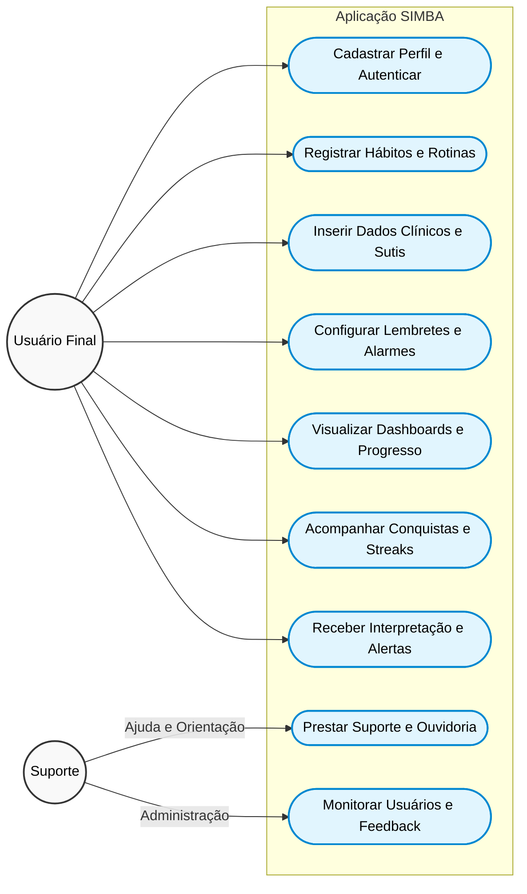

# SIMBA - Sistema Integrado de Monitoramento do Bem-estar Automatizado

> **Mufasa Softwares** | Disciplina: Práticas Interdisciplinares | Curso: Sistemas de Informação – UEG (Universidade Estadual de Goiás)

## Sobre o Projeto

O **SIMBA** é uma aplicação WEB centralizada, projetada para reunir diversas ferramentas relevantes para o exercício de um estilo de vida saudável. O projeto surge para solucionar um problema contemporâneo grave: a epidemia de ansiedade, burnout, sedentarismo e a sobrecarga mental gerada pela fragmentação de dados em múltiplos aplicativos de saúde.

O foco do SIMBA é oferecer conveniência, combatendo o "piloto automático" diário através do monitoramento integrado de sono, hidratação, alimentação, atividade física e indicadores clínicos sutis, tudo em uma interface simples e intuitiva.

---

## Objetivos Principais
- **Centralização:** Reunir diferentes ferramentas de monitoramento de saúde em um único lugar.
- **Rastreamento de Hábitos:** Registrar sono, consumo de água, alimentação e atividades físicas de forma simplificada.
- **Engajamento e Prevenção:** Sistema de lembretes (ex: medicamentos), streaks (ofensivas), conquistas e orientações preditivas baseadas na rotina do usuário.
- **Interpretação Acessível:** Traduzir dados fisiológicos para uma linguagem simples e clara para usuários leigos.

---

## Atores e Perfis de Usuários

1. **Usuário Final:** Interage diretamente com as funcionalidades de monitoramento, cadastra métricas, cria rotinas, acompanha dashboards e recebe lembretes.
2. **Suporte:** Responsável pela ouvidoria, auxílio técnico, orientação e monitoramento administrativo da plataforma.

---

## Diagrama de Caso de Uso (UML)

Abaixo apresentamos o diagrama de caso de uso do sistema SIMBA, ilustrando as interações entre os atores e os principais módulos da aplicação.

---

## Funcionalidades e Escopo (Versão 1.0)
- Autenticação e cadastro de perfil biométrico.
- Histórico de hidratação e registro simplificado de alimentação.
- Cronômetro de sono e cálculo de déficit de sono (descanso vs REM).
- Catálogo de exercícios, registro de treinos e estimativa de gasto calórico.
- Dashboard de progresso diário com sistema de ofensivas (streaks) e conquistas.
- Lembretes configuráveis e notificações médicas/preventivas.
- Inserção de dados vitais (pressão arterial, frequência cardíaca, peso).

---

## Tecnologias Utilizadas

A stack tecnológica definida para o projeto (Viabilidade Técnica) engloba:

*   **Frontend:** HTML, CSS, JavaScript (Interface web intuitiva e responsiva).
*   **Backend:** Java integrado ao framework Spring.
*   **Banco de Dados:** PostgreSQL (Estruturação de relacionamentos e persistência íntegra).
*   **Versionamento:** Git e GitHub.

---

## Equipe de Desenvolvimento
Projeto acadêmico desenvolvido pelos estudantes de Sistemas de Informação:
*   João Manoel
*   Samuel (CTO - Mufasa Softwares)
*   Pedro Lucas
*   Marco Túlio
*   Rubens
